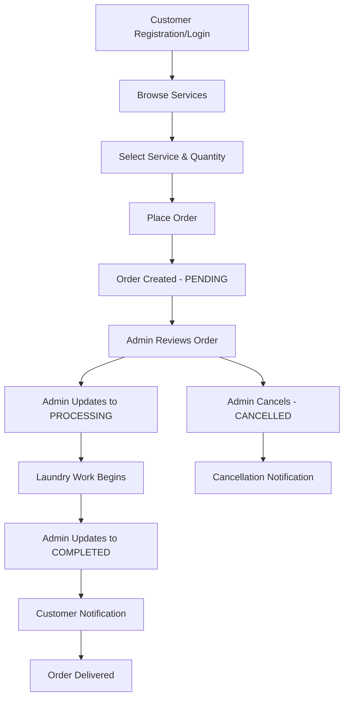
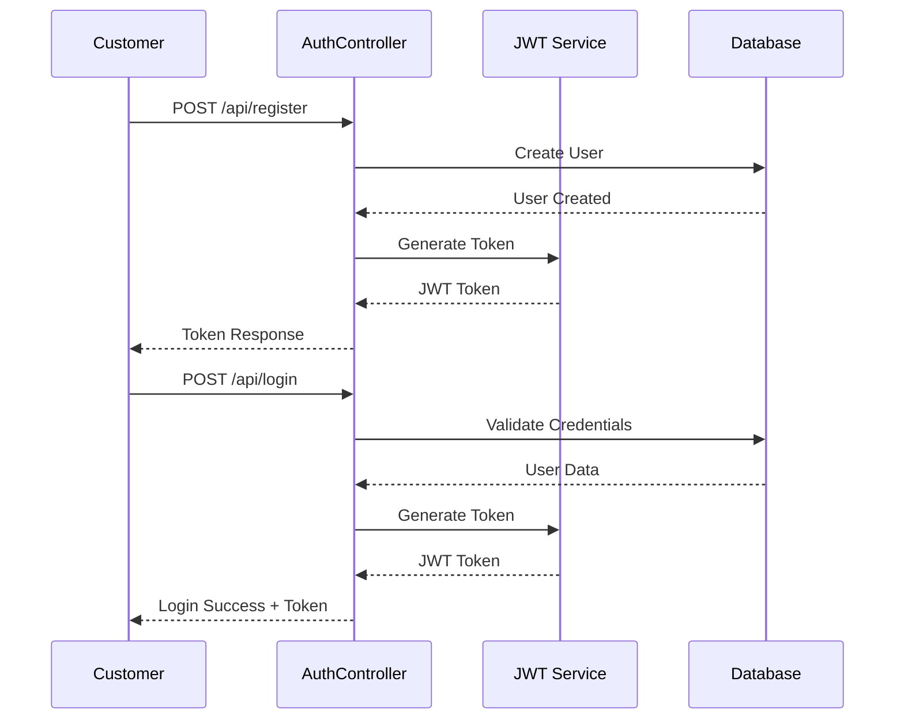
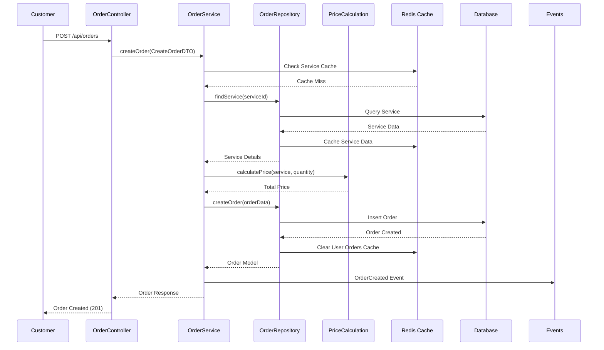
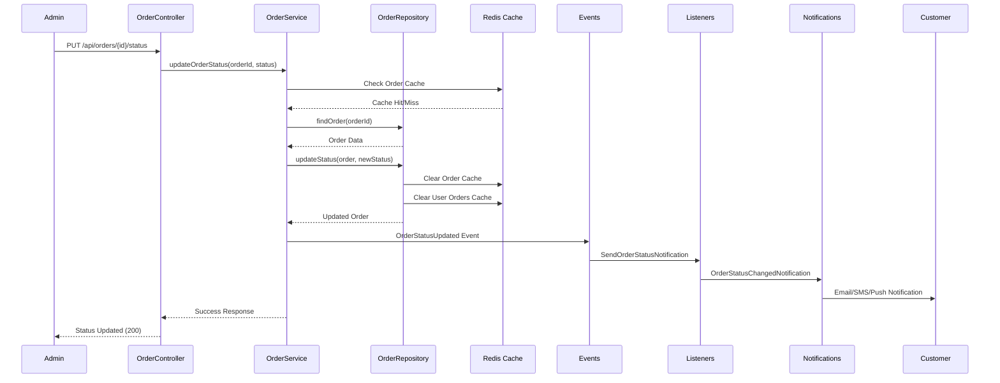
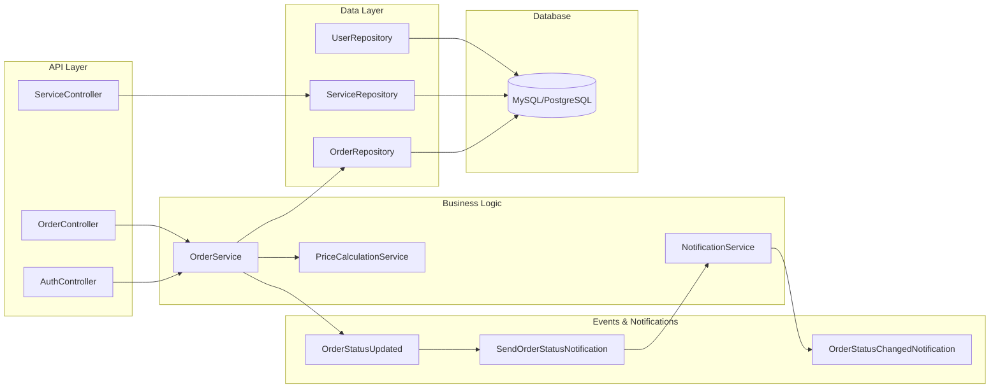
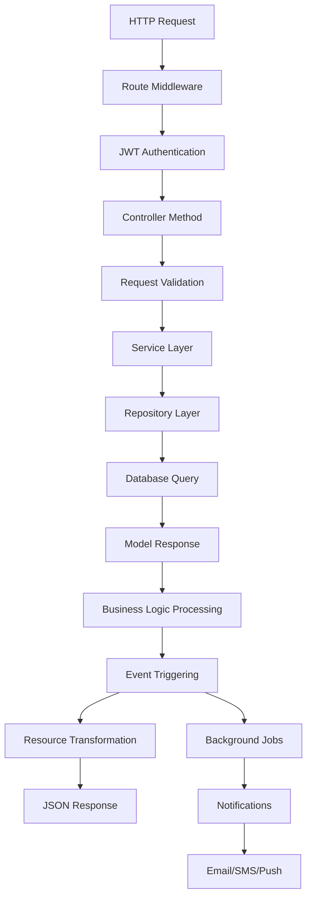
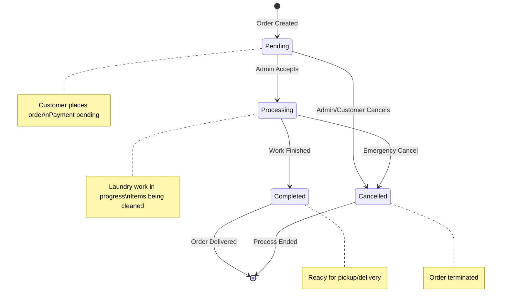
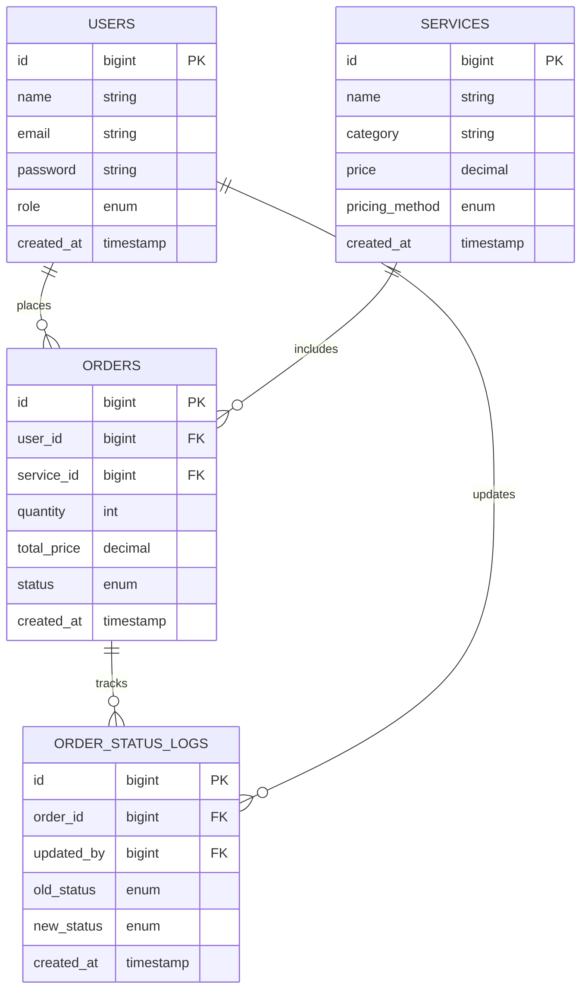

# 🧺 e-Laundry Order Service Workflow

## 📋 Complete Order Journey: Start to End

### 🔄 Order Lifecycle Overview



---

## 🏗️ System Architecture & Connectivity

### 1. **Authentication Flow**


### 2. **Order Creation Flow**


### 3. **Order Status Update Flow**


---

## 🔗 Component Connectivity Map

### **Core Components Interaction**


---

## 📊 Data Flow Architecture

### **Request-Response Cycle**


---

## 🎯 Order Status State Machine



---

## 🔧 Technical Implementation Details

### **Key Endpoints & Flow**

| Endpoint                  | Method | Flow                          | Status Changes                     |
|---------------------------|--------|-------------------------------|------------------------------------|
| `/api/register`           | POST   | User Registration → JWT Token | -                                  |
| `/api/login`              | POST   | Authentication → JWT Token    | -                                  |
| `/api/services`           | GET    | Fetch Available Services      | -                                  |
| `/api/orders`             | POST   | Create Order → PENDING        | `null → PENDING`                   |
| `/api/orders`             | GET    | List User Orders              | -                                  |
| `/api/orders/{id}`        | GET    | Order Details                 | -                                  |
| `/api/orders/{id}/status` | PUT    | Admin Status Update           | `PENDING → PROCESSING → COMPLETED` |

### **Database Relationships**


---

## 🚀 Quick Start Integration

### **1. Customer Journey**
```bash
# Register
POST /api/register
{
  "name": "John Doe",
  "email": "john@example.com",
  "password": "password123"
}

# Login
POST /api/login
{
  "email": "john@example.com",
  "password": "password123"
}

# Browse Services
GET /api/services

# Place Order
POST /api/orders
{
  "service_id": 1,
  "quantity": 5
}
```

### **2. Admin Workflow**
```bash
# Update Order Status
PUT /api/orders/1/status
{
  "status": "processing"
}

# Complete Order
PUT /api/orders/1/status
{
  "status": "completed"
}
```

---

## 📈 Performance & Scalability

### **Optimization Points**
- **Redis Caching**: Service data, order lists, user sessions, price calculations
- **Queue Jobs**: Email notifications, status updates
- **Database Indexing**: Order status, user_id, created_at
- **API Rate Limiting**: Prevent abuse
- **Event Broadcasting**: Real-time status updates
- **Cache Invalidation**: Smart cache clearing on data updates

### **Monitoring & Logging**
- Order creation/completion rates
- Status change frequency
- Notification delivery success
- API response times
- Database query performance

---

This workflow ensures seamless order management from customer registration to order completion, with robust admin controls and real-time notifications throughout the process.
