# 🧺 e-Laundry API - All Service Workflows

## 🔐 Authentication Service Workflow

### **User Registration & Login Flow**
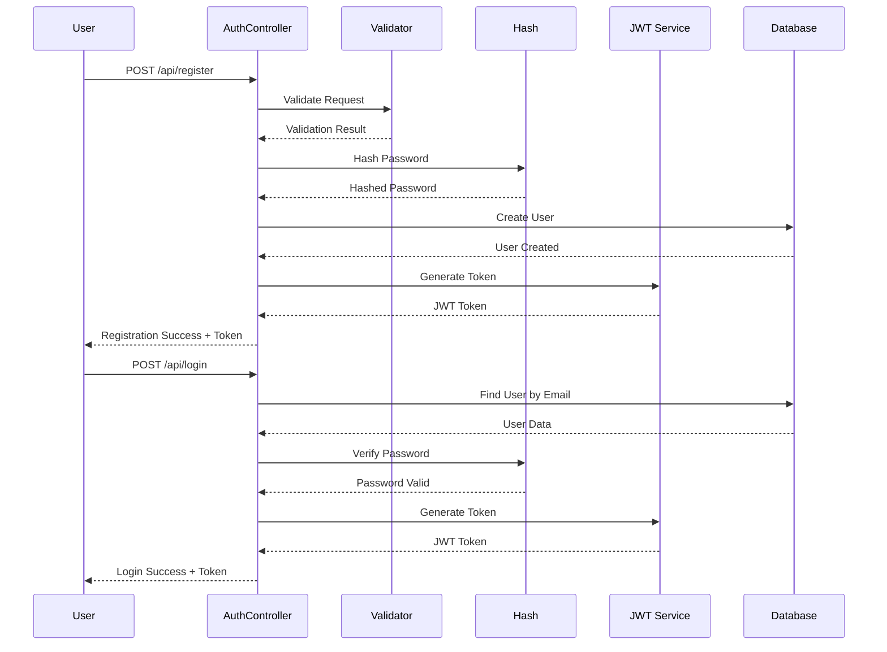
```mermaid
sequenceDiagram
    participant U as User
    participant AC as AuthController
    participant V as Validator
    participant H as Hash
    participant JWT as JWT Service
    participant DB as Database
    
    U->>AC: POST /api/register
    AC->>V: Validate Request
    V-->>AC: Validation Result
    AC->>H: Hash Password
    H-->>AC: Hashed Password
    AC->>DB: Create User
    DB-->>AC: User Created
    AC->>JWT: Generate Token
    JWT-->>AC: JWT Token
    AC-->>U: Registration Success + Token
    
    U->>AC: POST /api/login
    AC->>DB: Find User by Email
    DB-->>AC: User Data
    AC->>H: Verify Password
    H-->>AC: Password Valid
    AC->>JWT: Generate Token
    JWT-->>AC: JWT Token
    AC-->>U: Login Success + Token
```

### **JWT Token Lifecycle**
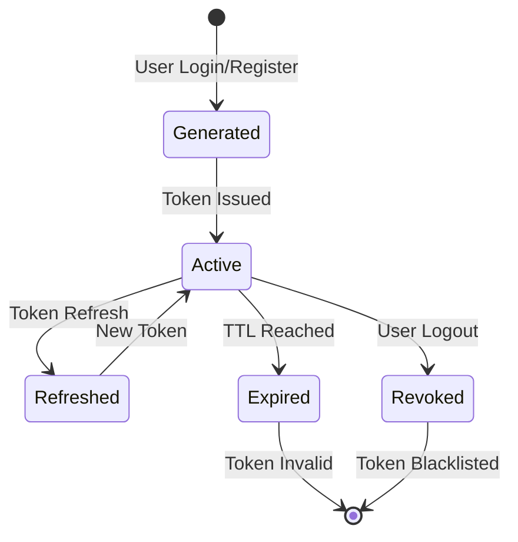
```mermaid
stateDiagram-v2
    [*] --> Generated: User Login/Register
    Generated --> Active: Token Issued
    Active --> Refreshed: Token Refresh
    Active --> Expired: TTL Reached
    Active --> Revoked: User Logout
    Refreshed --> Active: New Token
    Expired --> [*]: Token Invalid
    Revoked --> [*]: Token Blacklisted
```

---

## 🛍️ Service Management Workflow

### **Service CRUD Operations**
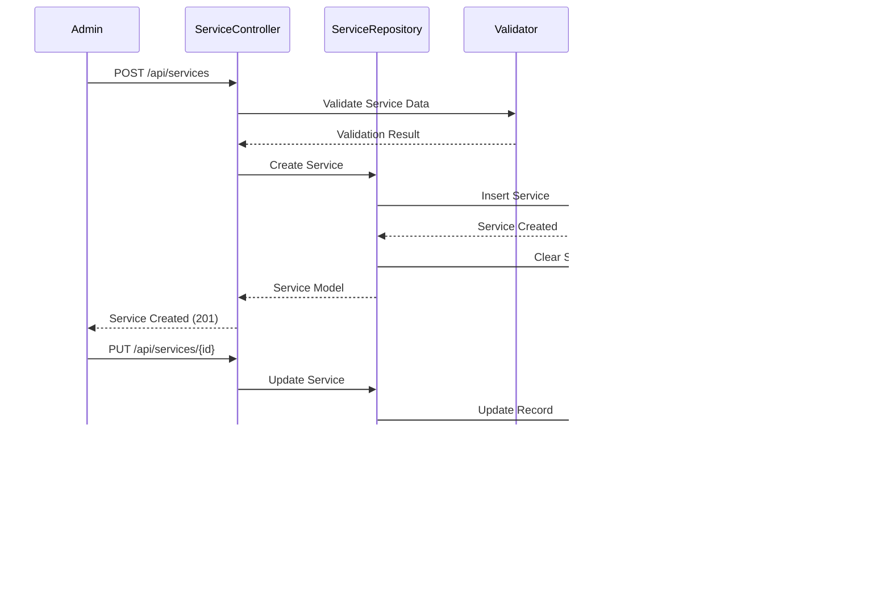
```mermaid
sequenceDiagram
    participant A as Admin
    participant SC as ServiceController
    participant SR as ServiceRepository
    participant V as Validator
    participant DB as Database
    participant C as Cache
    
    A->>SC: POST /api/services
    SC->>V: Validate Service Data
    V-->>SC: Validation Result
    SC->>SR: Create Service
    SR->>DB: Insert Service
    DB-->>SR: Service Created
    SR->>C: Clear Service Cache
    SR-->>SC: Service Model
    SC-->>A: Service Created (201)
    
    A->>SC: PUT /api/services/{id}
    SC->>SR: Update Service
    SR->>DB: Update Record
    DB-->>SR: Updated Service
    SR->>C: Clear Service Cache
    SR-->>SC: Updated Model
    SC-->>A: Service Updated (200)
```

### **Service Discovery Flow**
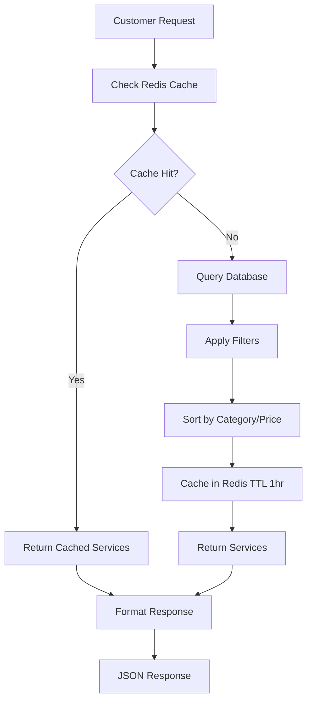
```mermaid
flowchart TD
    A[Customer Request] --> B[Check Redis Cache]
    B --> C{Cache Hit?}
    C -->|Yes| D[Return Cached Services]
    C -->|No| E[Query Database]
    E --> F[Apply Filters]
    F --> G[Sort by Category/Price]
    G --> H[Cache in Redis TTL 1hr]
    H --> I[Return Services]
    D --> J[Format Response]
    I --> J
    J --> K[JSON Response]
```

---

## 💰 Price Calculation Service Workflow

### **Dynamic Pricing Engine**
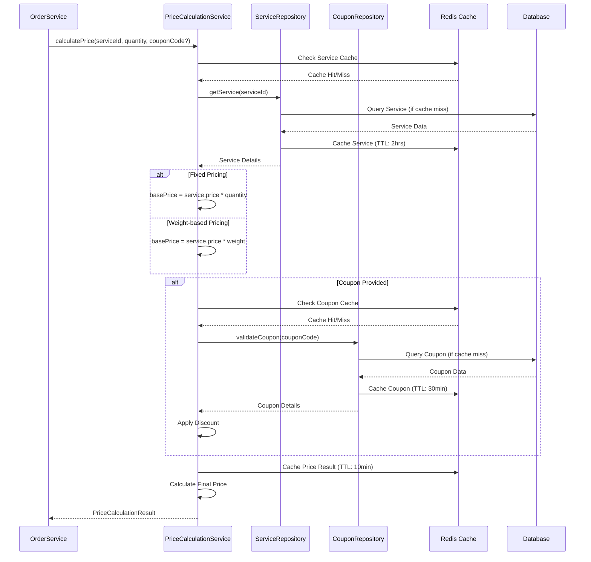
```mermaid
sequenceDiagram
    participant O as OrderService
    participant PC as PriceCalculationService
    participant SR as ServiceRepository
    participant CR as CouponRepository
    participant RC as Redis Cache
    participant DB as Database
    
    O->>PC: calculatePrice(serviceId, quantity, couponCode?)
    PC->>RC: Check Service Cache
    RC-->>PC: Cache Hit/Miss
    PC->>SR: getService(serviceId)
    SR->>DB: Query Service (if cache miss)
    DB-->>SR: Service Data
    SR->>RC: Cache Service (TTL: 2hrs)
    SR-->>PC: Service Details
    
    alt Fixed Pricing
        PC->>PC: basePrice = service.price * quantity
    else Weight-based Pricing
        PC->>PC: basePrice = service.price * weight
    end
    
    alt Coupon Provided
        PC->>RC: Check Coupon Cache
        RC-->>PC: Cache Hit/Miss
        PC->>CR: validateCoupon(couponCode)
        CR->>DB: Query Coupon (if cache miss)
        DB-->>CR: Coupon Data
        CR->>RC: Cache Coupon (TTL: 30min)
        CR-->>PC: Coupon Details
        PC->>PC: Apply Discount
    end
    
    PC->>RC: Cache Price Result (TTL: 10min)
    PC->>PC: Calculate Final Price
    PC-->>O: PriceCalculationResult
```

### **Pricing Method State Machine**
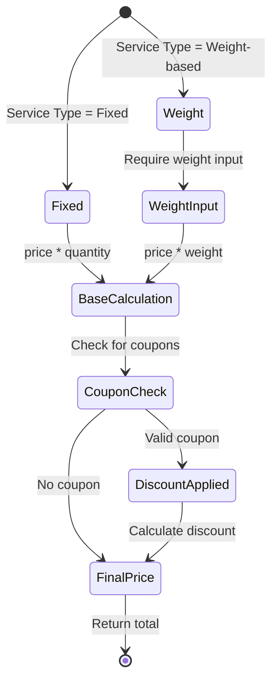
```mermaid
stateDiagram-v2
    [*] --> Fixed: Service Type = Fixed
    [*] --> Weight: Service Type = Weight-based
    
    Fixed --> BaseCalculation: price * quantity
    Weight --> WeightInput: Require weight input
    WeightInput --> BaseCalculation: price * weight
    
    BaseCalculation --> CouponCheck: Check for coupons
    CouponCheck --> DiscountApplied: Valid coupon
    CouponCheck --> FinalPrice: No coupon
    DiscountApplied --> FinalPrice: Calculate discount
    FinalPrice --> [*]: Return total
```

---

## 🔔 Notification Service Workflow

### **Multi-Channel Notification System**
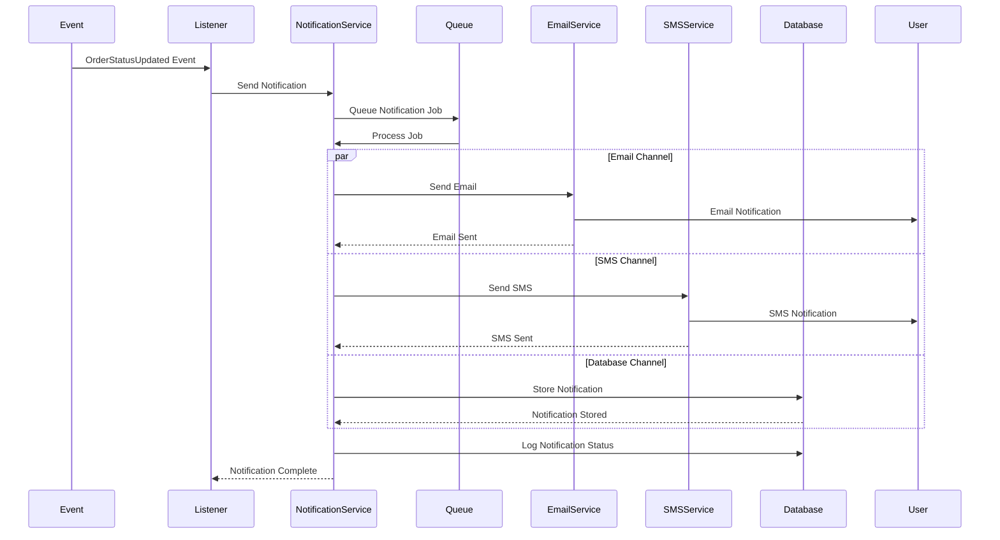
```mermaid
sequenceDiagram
    participant E as Event
    participant L as Listener
    participant NS as NotificationService
    participant Q as Queue
    participant EM as EmailService
    participant SMS as SMSService
    participant DB as Database
    participant U as User
    
    E->>L: OrderStatusUpdated Event
    L->>NS: Send Notification
    NS->>Q: Queue Notification Job
    Q->>NS: Process Job
    
    par Email Channel
        NS->>EM: Send Email
        EM->>U: Email Notification
        EM-->>NS: Email Sent
    and SMS Channel
        NS->>SMS: Send SMS
        SMS->>U: SMS Notification
        SMS-->>NS: SMS Sent
    and Database Channel
        NS->>DB: Store Notification
        DB-->>NS: Notification Stored
    end
    
    NS->>DB: Log Notification Status
    NS-->>L: Notification Complete
```

### **Notification Channel Selection**
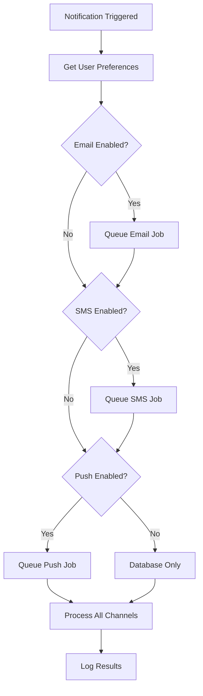
```mermaid
flowchart TD
    A[Notification Triggered] --> B[Get User Preferences]
    B --> C{Email Enabled?}
    C -->|Yes| D[Queue Email Job]
    C -->|No| E{SMS Enabled?}
    D --> E
    E -->|Yes| F[Queue SMS Job]
    E -->|No| G{Push Enabled?}
    F --> G
    G -->|Yes| H[Queue Push Job]
    G -->|No| I[Database Only]
    H --> J[Process All Channels]
    I --> J
    J --> K[Log Results]
```

---

## 👨‍💼 Admin Management Workflow

### **Admin Dashboard Operations**
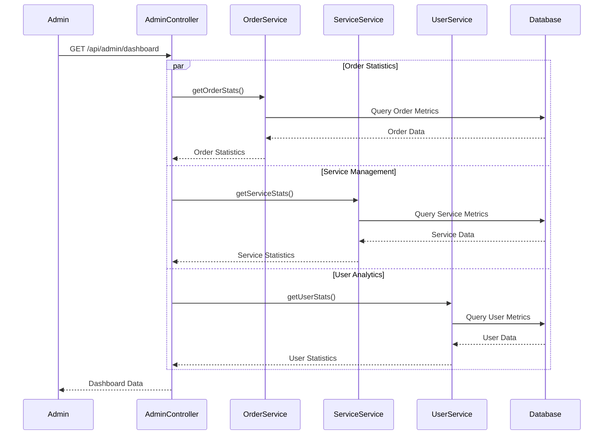
```mermaid
sequenceDiagram
    participant A as Admin
    participant AC as AdminController
    participant OS as OrderService
    participant SS as ServiceService
    participant US as UserService
    participant DB as Database
    
    A->>AC: GET /api/admin/dashboard
    
    par Order Statistics
        AC->>OS: getOrderStats()
        OS->>DB: Query Order Metrics
        DB-->>OS: Order Data
        OS-->>AC: Order Statistics
    and Service Management
        AC->>SS: getServiceStats()
        SS->>DB: Query Service Metrics
        DB-->>SS: Service Data
        SS-->>AC: Service Statistics
    and User Analytics
        AC->>US: getUserStats()
        US->>DB: Query User Metrics
        DB-->>US: User Data
        US-->>AC: User Statistics
    end
    
    AC-->>A: Dashboard Data
```

### **Order Management by Admin**
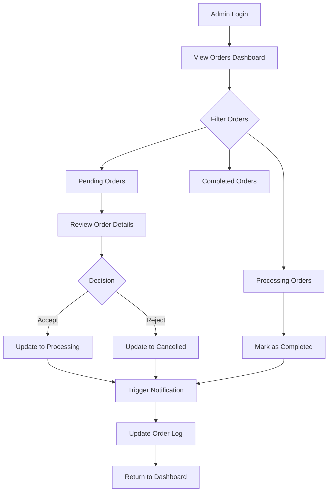
```mermaid
flowchart TD
    A[Admin Login] --> B[View Orders Dashboard]
    B --> C{Filter Orders}
    C --> D[Pending Orders]
    C --> E[Processing Orders]
    C --> F[Completed Orders]
    
    D --> G[Review Order Details]
    G --> H{Decision}
    H -->|Accept| I[Update to Processing]
    H -->|Reject| J[Update to Cancelled]
    
    E --> K[Mark as Completed]
    
    I --> L[Trigger Notification]
    J --> L
    K --> L
    L --> M[Update Order Log]
    M --> N[Return to Dashboard]
```

---

## 📊 Reporting Service Workflow

### **Analytics & Reports Generation**
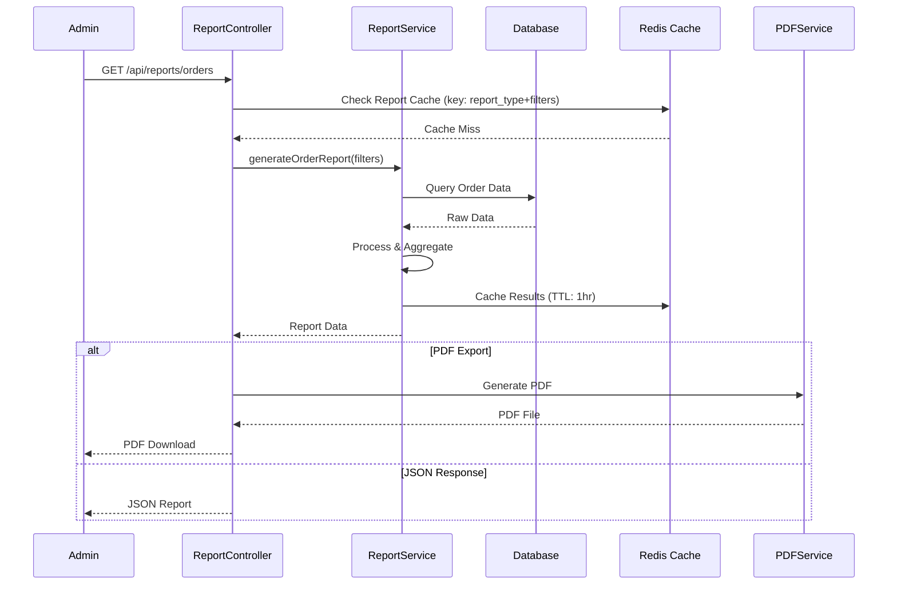
```mermaid
sequenceDiagram
    participant A as Admin
    participant RC as ReportController
    participant RS as ReportService
    participant DB as Database
    participant RDC as Redis Cache
    participant PDF as PDFService
    
    A->>RC: GET /api/reports/orders
    RC->>RDC: Check Report Cache (key: report_type+filters)
    RDC-->>RC: Cache Miss
    RC->>RS: generateOrderReport(filters)
    RS->>DB: Query Order Data
    DB-->>RS: Raw Data
    RS->>RS: Process & Aggregate
    RS->>RDC: Cache Results (TTL: 1hr)
    RS-->>RC: Report Data
    
    alt PDF Export
        RC->>PDF: Generate PDF
        PDF-->>RC: PDF File
        RC-->>A: PDF Download
    else JSON Response
        RC-->>A: JSON Report
    end
```

### **Report Types & Data Flow**
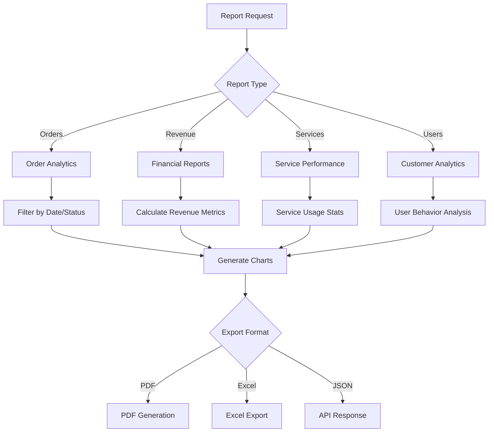
```mermaid
flowchart TD
    A[Report Request] --> B{Report Type}
    
    B -->|Orders| C[Order Analytics]
    B -->|Revenue| D[Financial Reports]
    B -->|Services| E[Service Performance]
    B -->|Users| F[Customer Analytics]
    
    C --> G[Filter by Date/Status]
    D --> H[Calculate Revenue Metrics]
    E --> I[Service Usage Stats]
    F --> J[User Behavior Analysis]
    
    G --> K[Generate Charts]
    H --> K
    I --> K
    J --> K
    
    K --> L{Export Format}
    L -->|PDF| M[PDF Generation]
    L -->|Excel| N[Excel Export]
    L -->|JSON| O[API Response]
```

---

## 🔍 Search & Filter Service Workflow

### **Advanced Search System**
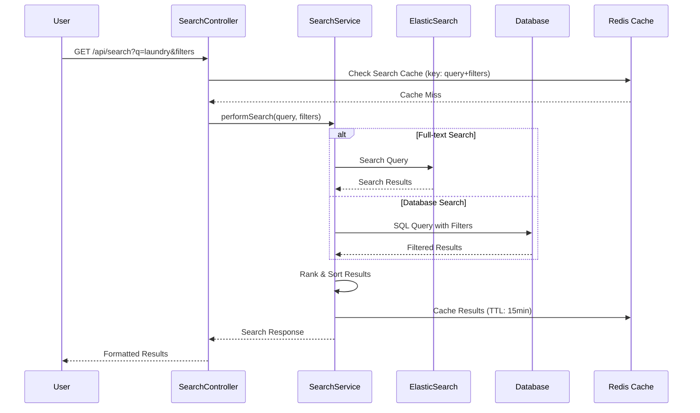
```mermaid
sequenceDiagram
    participant U as User
    participant SC as SearchController
    participant SS as SearchService
    participant ES as ElasticSearch
    participant DB as Database
    participant RC as Redis Cache
    
    U->>SC: GET /api/search?q=laundry&filters
    SC->>RC: Check Search Cache (key: query+filters)
    RC-->>SC: Cache Miss
    SC->>SS: performSearch(query, filters)
    
    alt Full-text Search
        SS->>ES: Search Query
        ES-->>SS: Search Results
    else Database Search
        SS->>DB: SQL Query with Filters
        DB-->>SS: Filtered Results
    end
    
    SS->>SS: Rank & Sort Results
    SS->>RC: Cache Results (TTL: 15min)
    SS-->>SC: Search Response
    SC-->>U: Formatted Results
```

### **Filter Application Logic**
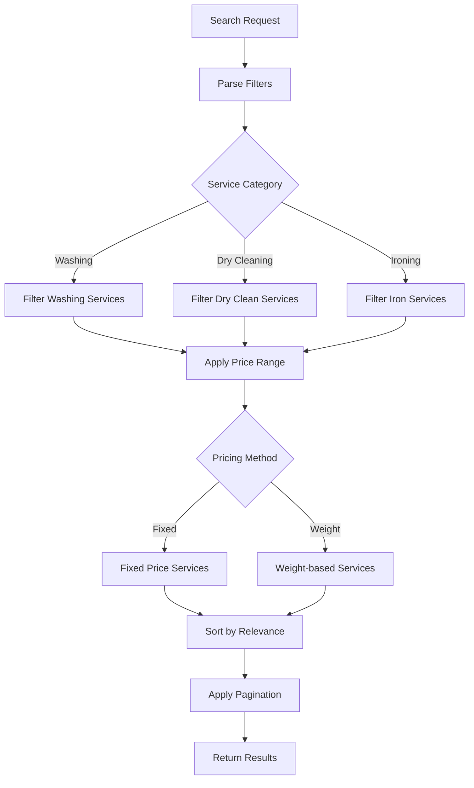
```mermaid
flowchart TD
    A[Search Request] --> B[Parse Filters]
    B --> C{Service Category}
    C -->|Washing| D[Filter Washing Services]
    C -->|Dry Cleaning| E[Filter Dry Clean Services]
    C -->|Ironing| F[Filter Iron Services]
    
    D --> G[Apply Price Range]
    E --> G
    F --> G
    
    G --> H{Pricing Method}
    H -->|Fixed| I[Fixed Price Services]
    H -->|Weight| J[Weight-based Services]
    
    I --> K[Sort by Relevance]
    J --> K
    K --> L[Apply Pagination]
    L --> M[Return Results]
```

---

## 🔄 Background Job Processing Workflow

### **Queue System Architecture**
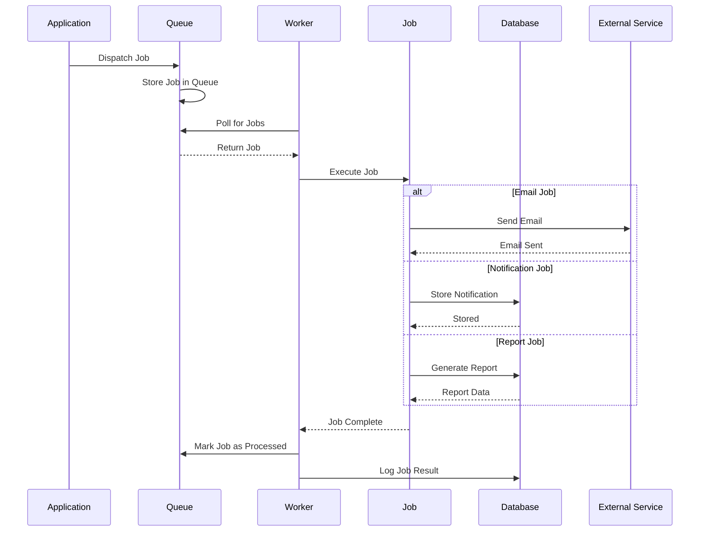
```mermaid
sequenceDiagram
    participant A as Application
    participant Q as Queue
    participant W as Worker
    participant J as Job
    participant DB as Database
    participant E as External Service
    
    A->>Q: Dispatch Job
    Q->>Q: Store Job in Queue
    W->>Q: Poll for Jobs
    Q-->>W: Return Job
    W->>J: Execute Job
    
    alt Email Job
        J->>E: Send Email
        E-->>J: Email Sent
    else Notification Job
        J->>DB: Store Notification
        DB-->>J: Stored
    else Report Job
        J->>DB: Generate Report
        DB-->>J: Report Data
    end
    
    J-->>W: Job Complete
    W->>Q: Mark Job as Processed
    W->>DB: Log Job Result
```

### **Job Priority & Retry Logic**
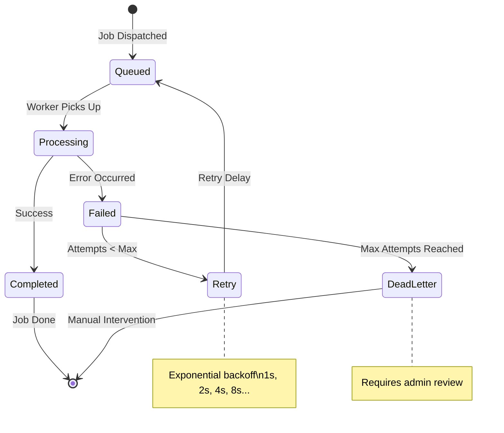
```mermaid
stateDiagram-v2
    [*] --> Queued: Job Dispatched
    Queued --> Processing: Worker Picks Up
    Processing --> Completed: Success
    Processing --> Failed: Error Occurred
    Failed --> Retry: Attempts < Max
    Failed --> DeadLetter: Max Attempts Reached
    Retry --> Queued: Retry Delay
    Completed --> [*]: Job Done
    DeadLetter --> [*]: Manual Intervention
    
    note right of Retry: Exponential backoff\n1s, 2s, 4s, 8s...
    note right of DeadLetter: Requires admin review
```

---

## 🔒 Security & Validation Workflow

### **Request Security Pipeline**
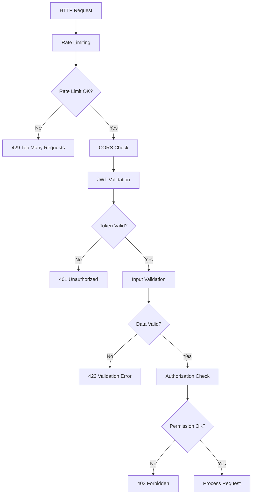
```mermaid
flowchart TD
    A[HTTP Request] --> B[Rate Limiting]
    B --> C{Rate Limit OK?}
    C -->|No| D[429 Too Many Requests]
    C -->|Yes| E[CORS Check]
    E --> F[JWT Validation]
    F --> G{Token Valid?}
    G -->|No| H[401 Unauthorized]
    G -->|Yes| I[Input Validation]
    I --> J{Data Valid?}
    J -->|No| K[422 Validation Error]
    J -->|Yes| L[Authorization Check]
    L --> M{Permission OK?}
    M -->|No| N[403 Forbidden]
    M -->|Yes| O[Process Request]
```

### **Data Validation Layers**
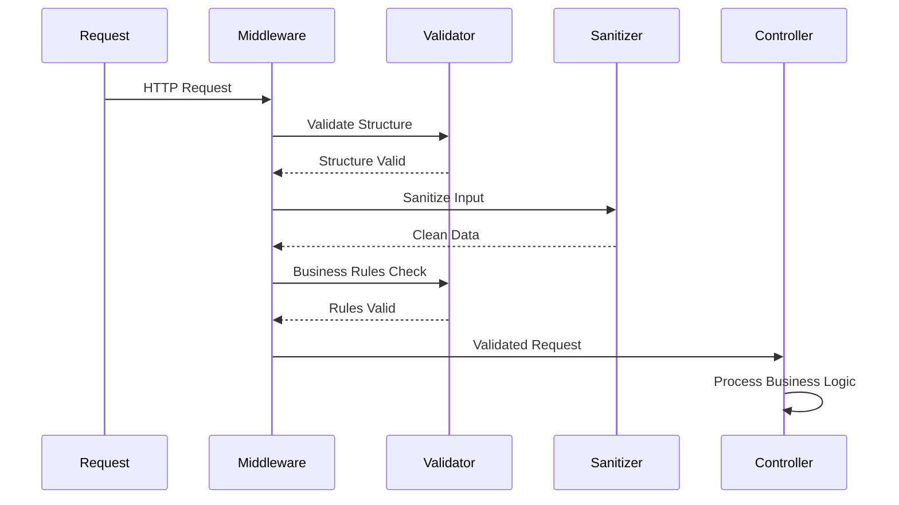
```mermaid
sequenceDiagram
    participant R as Request
    participant M as Middleware
    participant V as Validator
    participant S as Sanitizer
    participant C as Controller
    
    R->>M: HTTP Request
    M->>V: Validate Structure
    V-->>M: Structure Valid
    M->>S: Sanitize Input
    S-->>M: Clean Data
    M->>V: Business Rules Check
    V-->>M: Rules Valid
    M->>C: Validated Request
    C->>C: Process Business Logic
```

---

This comprehensive workflow documentation covers all major services in the e-Laundry API, showing how each component interacts and processes requests from start to finish.