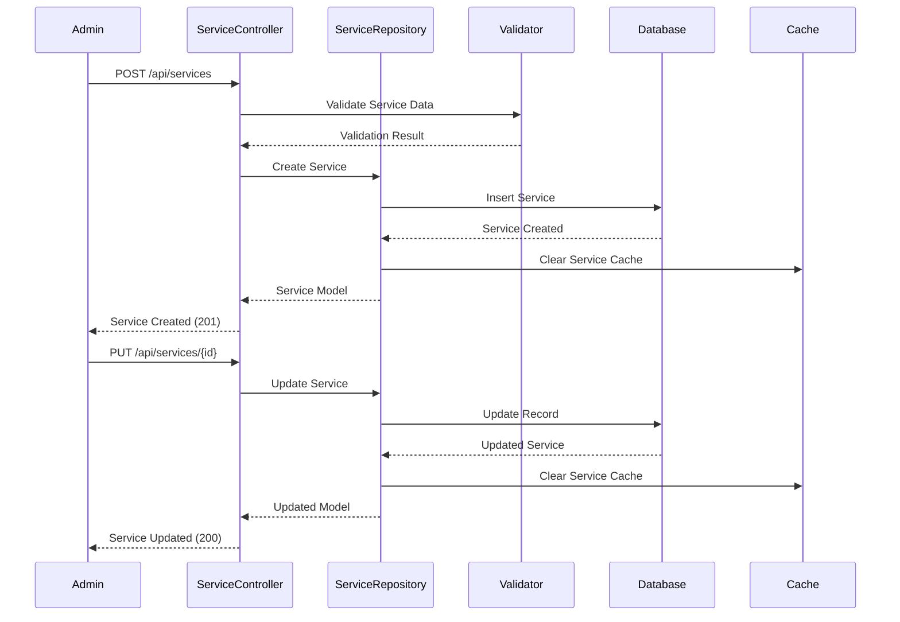

# 🧺 e-Laundry API - All Service Workflows

## 🔐 Authentication Service Workflow

### **User Registration & Login Flow**

### **JWT Token Lifecycle**

---

## 🛍️ Service Management Workflow

### **Service CRUD Operations**

### **Service Discovery Flow**

---

## 💰 Price Calculation Service Workflow

### **Dynamic Pricing Engine**

### **Pricing Method State Machine**

---

## 🔔 Notification Service Workflow

### **Multi-Channel Notification System**

### **Notification Channel Selection**

---

## 👨‍💼 Admin Management Workflow

### **Admin Dashboard Operations**

### **Order Management by Admin**

---

## 📊 Reporting Service Workflow

### **Analytics & Reports Generation**

### **Report Types & Data Flow**

---

## 🔍 Search & Filter Service Workflow

### **Advanced Search System**

### **Filter Application Logic**

---

## 🔄 Background Job Processing Workflow

### **Queue System Architecture**

### **Job Priority & Retry Logic**

---

## 🔒 Security & Validation Workflow

### **Request Security Pipeline**

### **Data Validation Layers**

---

This comprehensive workflow documentation covers all major services in the e-Laundry API, showing how each component interacts and processes requests from start to finish.