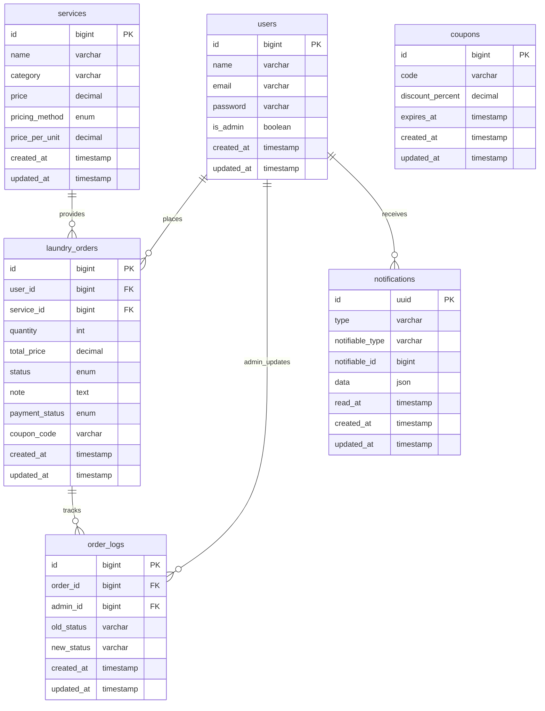
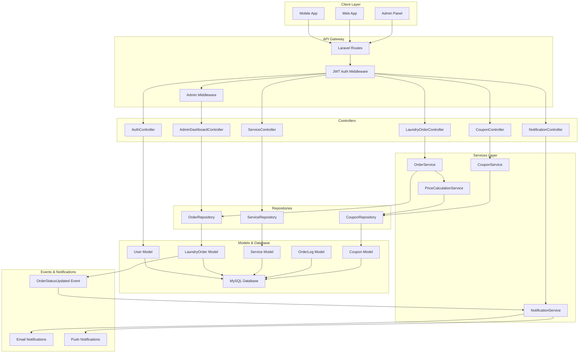
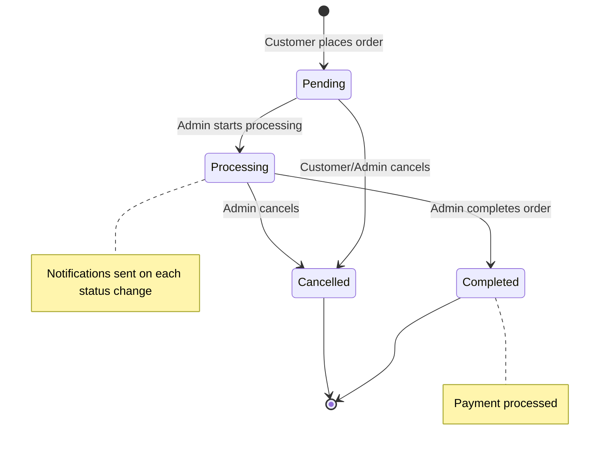
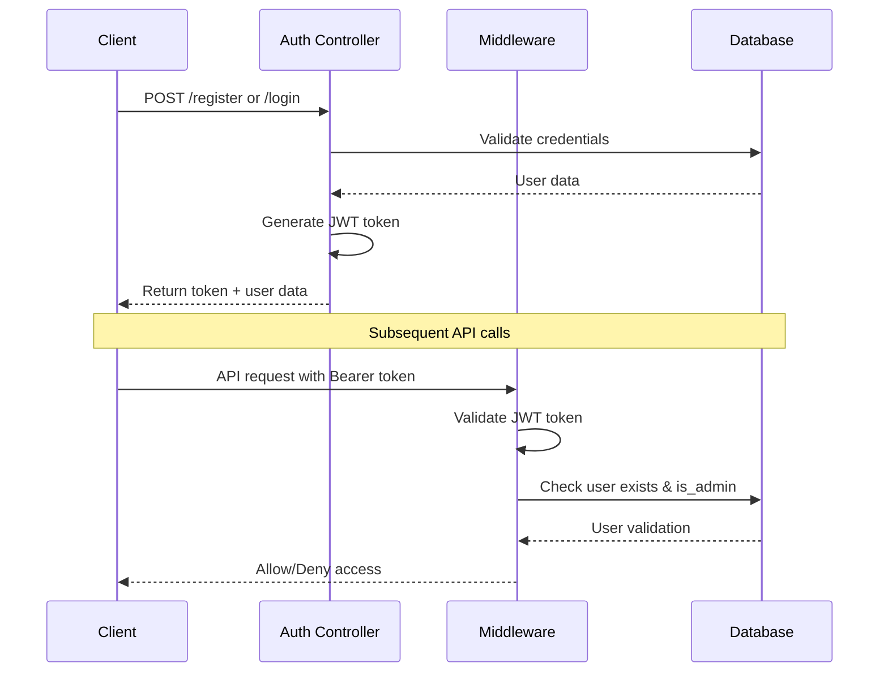
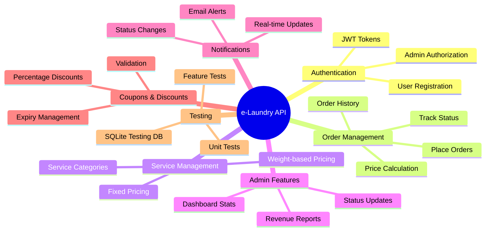

# 🧺 e-Laundry API - Project Architecture

## Database Schema & Relationships

## API Architecture Flow

## Order Status Flow

## Authentication & Authorization Flow

## Service Architecture Components

## Key Features Overview

### 🔐 Authentication System
- JWT-based authentication using Laravel Sanctum
- User registration and login
- Admin role-based access control
- Protected API routes

### 📦 Order Management
- Create orders with quantity and service selection
- Real-time order status tracking (Pending → Processing → Completed/Cancelled)
- Order history and filtering
- Price calculation with coupon support

### 👨‍💼 Admin Controls
- Update order status with logging
- Dashboard with statistics
- Revenue reporting
- Order management interface

### 🔔 Notification System
- Email notifications on status changes
- Real-time notifications
- Notification history and read status

### 💰 Pricing & Coupons
- Fixed and weight-based pricing methods
- Coupon validation and discount application
- Price calculation service

### 🧪 Testing Infrastructure
- Feature tests for API endpoints
- Unit tests for business logic
- SQLite in-memory testing database
- GitHub Actions CI/CD ready